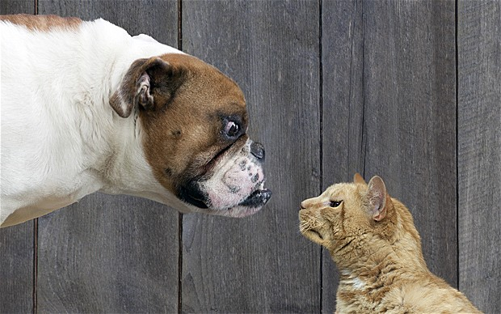
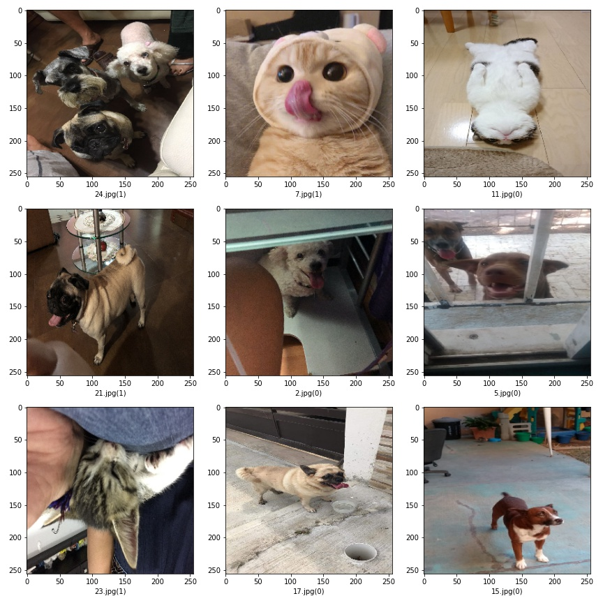

# Dogs vs. Cats 

## Kaggle Competition

This competition consists to create an algorithm to classify whether images contain either a dog or a cat. This is easy for humans, dogs, and cats. The computer will find it a bit more difficult.

## Data set

Asirra (Animal Species Image Recognition for Restricting Access) is a HIP that works by asking users to identify photographs of cats and dogs. This task is difficult for computers, but studies have shown that people can accomplish it quickly and accurately.

Asirra is unique because of its partnership with Petfinder.com, the world's largest site devoted to finding homes for homeless pets. They've provided Microsoft Research with over three million images of cats and dogs, manually classified by people at thousands of animal shelters across the United States. Kaggle is fortunate to offer a subset of this data for fun and research. 

## Image Recognition Attacks

While random guessing is the easiest form of attack, various forms of image recognition can allow an attacker to make guesses that are better than random. There is enormous diversity in the photo database (a wide variety of backgrounds, angles, poses, lighting, etc.), making accurate automatic classification difficult.

## Algorithm

* To solve this classification problem, a Convolutional Neural Network was trained using a VGG16 arquitecture and a pre-trained model. Since there are some approaches to this problem using the Sequential and Fine-Tuning model, here the Transfer Learning method was used.

* The algorithm was runned in Google Collab GPU taking 15 minutes for training, and giving an accuracy of 0.87.

* The neural network was trained with a dataset of around 600 images and tested with two different sets: i) the dataset in the competition page and, ii) personal and internet photos.

Here is a view of some testing images (0: cat, 1: dog).

### References

[Kaggle](https://www.kaggle.com/c/dogs-vs-cats)

[VGG16 Notebook for Fine-Tuning](https://www.kaggle.com/bulentsiyah/dogs-vs-cats-classification-vgg16-fine-tuning)